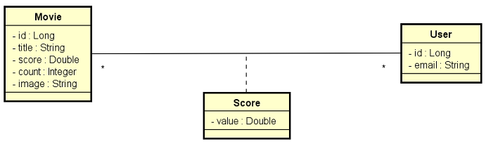

  <h3>
  
<b>DSMovie</b>

  </h3>
  Semana Spring React 7.0 - App completo com as tecnologias mais demandadas do mercado, como: Java, Spring, React, Typescript.
  

### • **Sobre**
DSMovie é uma aplicação full-stack web e mobile desenvolvida durante a **Semana Spring React 7.0**, evento organizado pela **[DevSuperior](https://devsuperior.com)**.

A aplicação consiste em uma página web, onde o front-end foi desenvolvido com React. E a listagem de filmes com um sistema de score, onde o back-end foi desenvolvido com spring. A página permite a interação dos usuários através das avaliações dos filmes listados.

**[Clique aqui para acessar o deploy](https://bielldsmovie.netlify.app)** (O back-end está hospedado no Heroku, então há um intervalo para aparecer a listagem)

  

  <h3>
<b>Paginas</b>

   
   
   
   
  <h3>
<b>Diagrama</b>

   
    

  

### **Linguagens e Ferramentas Utilizadas** 🛠

-  Java
-  Spring
-  React
-  TypeScript
-  CSS3
-  PostgreSql
-  Visual Studio Code

-  Git
